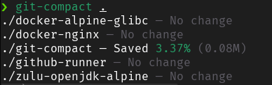

# git-compact
[](https://github.com/michaelcoll/git-compact/actions/workflows/build.yml) 

A small tool written in Go lang to execute the git gc command in the specified folder and its subfolders

## Requirements

The `du` and `git` command are needed.

## Usage

```shell
$> git-compact .
```

This will scan for git repository in your current directory and if it finds one, it will execute the `git gc --aggressive` command.

## Result
